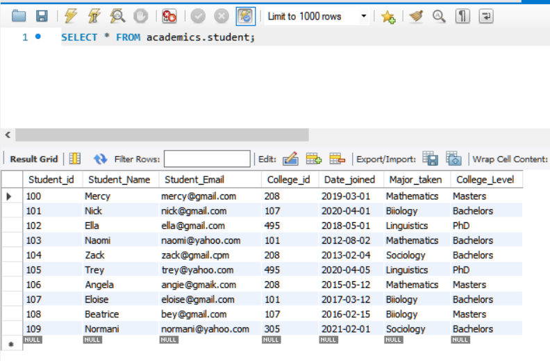

# SchoolDatabase
## About the project
A MYSQL School Database witten in Python and Mysql. 
The database is made up of three tables as illustrated below:

## Main.py
All the python code is contained in this file. The following are the steps taken in each block of code:
-   Create a MySQL database connection  called Academics. 
-   Create the three tables: College, Proffessor and Student.
-   Insert records into the tables from the corresponding CSV files
-   Create a function to join the tables using College_id and display records from the 3 joined tables on the screen:

